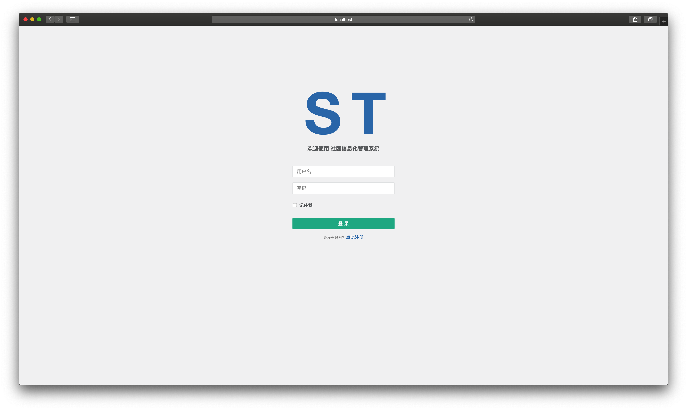
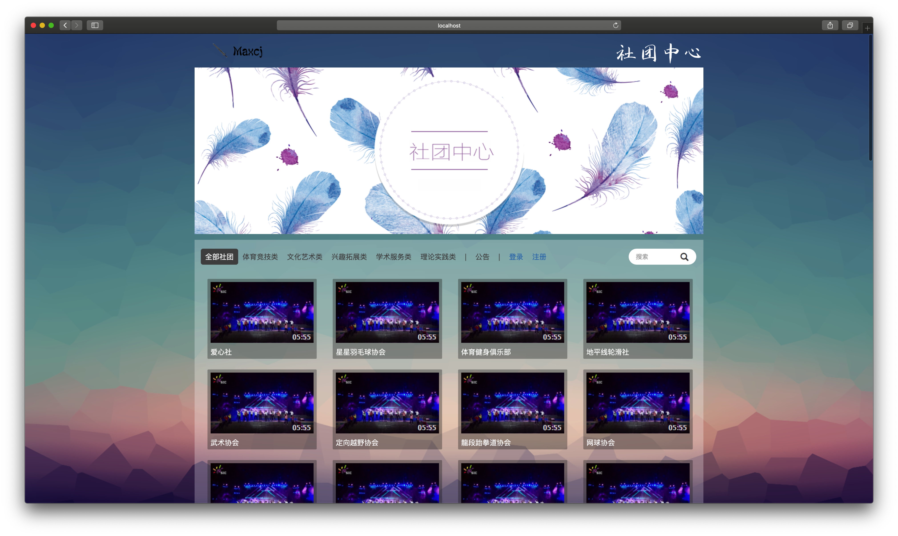
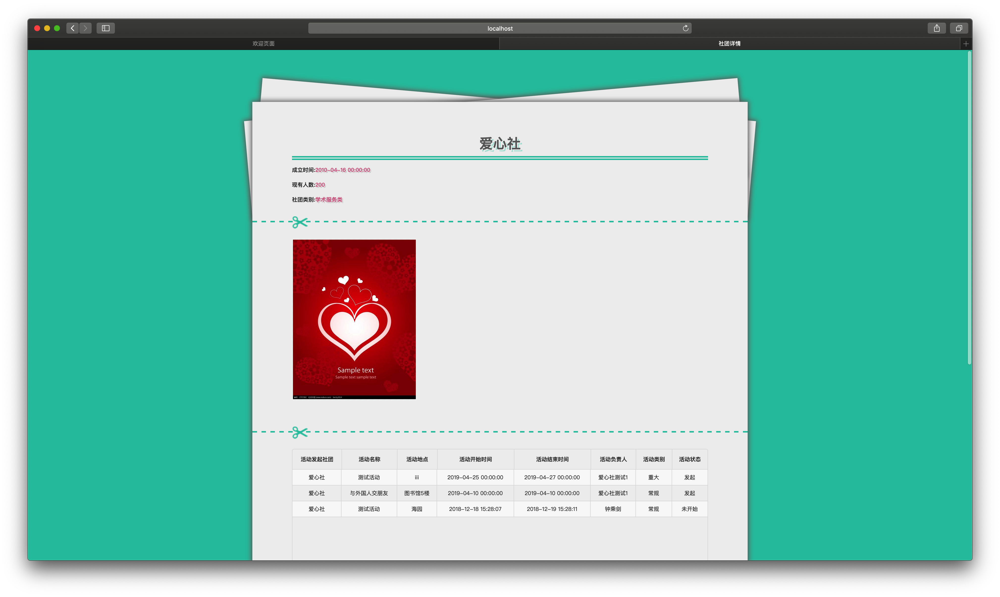
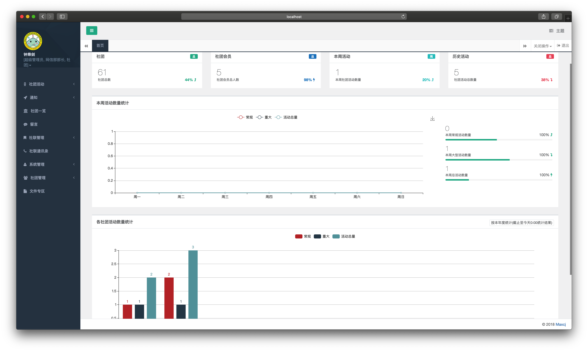
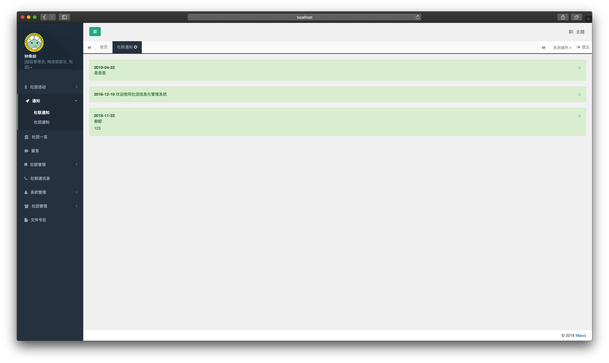
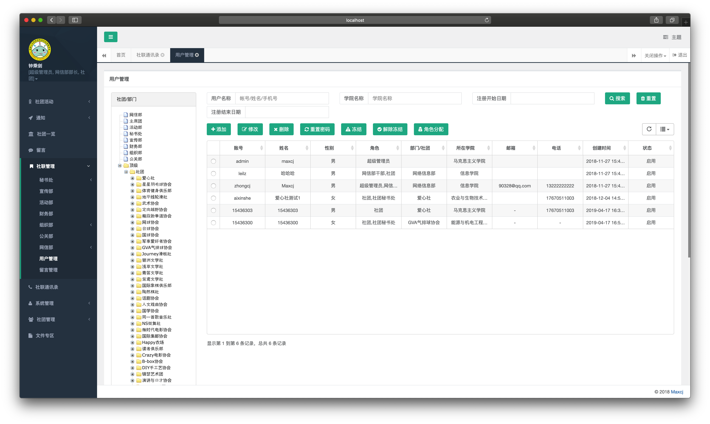
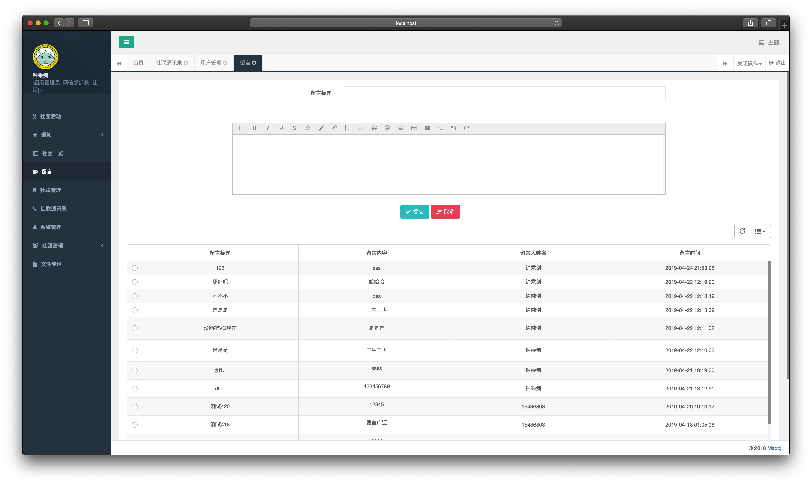
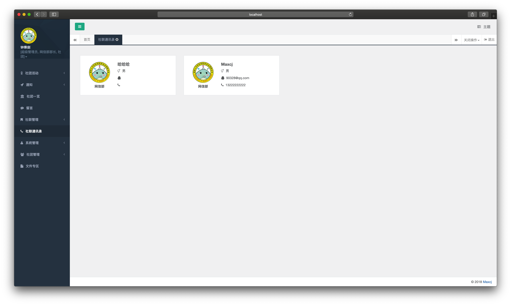
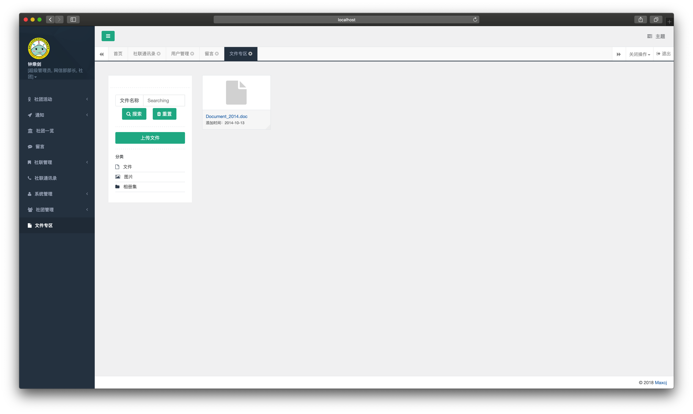

# 社团信息化系统的设计与实现

~~演示地址：http://maxcj.cn/Maxcj~~

+ 用户名：zhongcj
+ 密码：111111

---
## 1、为什么要做这个系统

> 针对我校社团管理零散，不统一，各类审批不及时的问题。通过这个系统，既方便社团管理人员，也可以缩短时间。而且信息化有利于降低成本。

## 2、技术选型

- 基于SpringBoot
- 整合：
  - SpringMVC
  - Shiro
  - Mybatis-Plus
  - Beetl
- ~~JBPM / Activiti / Flowable~~（整合一直报错，准备删了）

## 3、包含的功能

### 3.1、基础功能

- 用户管理：主要完成系统用户的配置
- 角色管理：角色菜单权限分配
- 社团管理：配置组织机构，树结构展现
- 菜单管理：配置系统菜单、操作权限
- 通知管理：主要完成系统的通知公告信息的发布与维护
- 留言管理：所有用户都可以进行留言

### 3.2、进阶功能

- 社团各类场景化
  - ~~流程审批：活动、财务报账流程的审批（采用JBPM / Activiti / Flowable业务流程管理）~~
  - 各类报表计算展示：通过数据可视化方案展现基本数据（采用Kettle数据抽取生成展示数据）
  - 定时任务：在线的任务调度（采用Kettle工具执行任务调度）
  - ……
- 系统运行监控
  - 登录日志：系统登录日志记录包含登录异常
  - 业务日志：系统正常操作日志记录和查询
  - ……

## 4、部分截图

登录/注册

---

欢迎界面（前台主界面）

---

社团详情

---

后台主页

---

通知页面

---

用户管理

---

留言

---

社联通讯录

---

文件专区

> 本项目基于Guns后台管理系统二次开发
